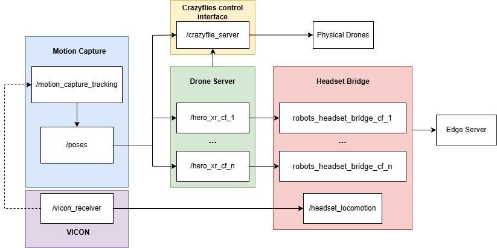

# HERO_XR

## Project Overview
HERO_XR is a ROS2-based drone control system that enables control of Crazyflie drones through VR/AR headset devices. The system supports multi-drone collaborative control and integrates with the VICON motion capture system for precise positioning.

## System Architecture
The system consists of the following main ROS packages:
- Modified crazyswarm2 (Original instruction: [https://imrclab.github.io/crazyswarm2/](https://imrclab.github.io/crazyswarm2/))
- motion_capture_tracking (Original repo: [https://github.com/IMRCLab/motion_capture_tracking](https://github.com/IMRCLab/motion_capture_tracking/))
- headset_ros_bridge
- ros2-vicon-receiver (Original repo:[https://github.com/OPT4SMART/ros2-vicon-receiver](https://github.com/OPT4SMART/ros2-vicon-receiver/)) 



### Architecture Components Description:
1. **Crazyswarm2**
   - `/crazyfile_server`: Manages direct control and communication with physical drones

2. **Motion Capture System**
   A package to support Crazyflies with different mocap system.
   - `/motion_capture_tracking`: Processes VICON camera data
   - `/poses`: Publishes all drones' position data

3. **VICON Receiver**
   - `/vicon_receiver`: 接收来自动作捕捉相机的原始 VICON 数据
   - 提供头戴设备的位置追踪功能
   - 支持多目标物体的实时位置追踪

4. **Drone Server**
   - `/hero_xr_cf_1` 到 `/hero_xr_cf_n` 节点：独立的无人机控制节点
   - 支持多无人机实例的并行控制
   - 提供无人机状态监控和异常处理
   - 实现与 VICON 系统的位置数据同步

5. **Headset Bridge**
   - `/robots_headset_bridge_cf_1` to `/robots_headset_bridge_cf_n`: Bridge nodes for each drone
   - `/headset_locomotion`: Processes headset movement data
   - Connects to Edge Server for AR interaction

The system follows a modular architecture where motion capture data flows through the drone server to control physical drones, while the headset bridge enables user interaction through AR devices.

## Usage Instructions
### 1. Install Dependencies
For crazyflies' path planning, we are using ["Pathfinding3D"](https://pypi.org/project/pathfinding3d/)
```bash
# Update rosdep
sudo rosdep init
rosdep update

# Install required dependencies
cd ~/ros_code
rosdep install --from-paths ros_code -y --ignore-src

# Install Python packages for path planning and visualization
pip install numpy open3d matplotlib pathfinding3d pyyaml

# Build workspace
cd ros_code
colcon build
source install/setup.bash
```

### 2. Launch VICON System
Before launching the node，make sure VICON is tracking all objects you need.
```bash
# Start VICON motion capture system
ros2 launch vicon_receiver client.launch.py
```

### 3. Start Headset Server
Start the server before launching 
```bash
# Navigate to server directory
cd ~/Documents/crazyflies_headset_codebase/server_code
# Launch Web server
python -m uvicorn ViconDroneServer:app --host 0.0.0.0 --port 8000 --reload
```

### 4. Start Drone Control Server
Note: DroneServer_Launch.py and hero_xy.py files locate at "crazyflie_ar" package. To extend to different robots, you should copy and modify the hero_xr to adapt your robots. The launch file is reading the .yaml file in "config" to create nodes. 
```bash
# Launch Crazyflie control server
ros2 launch crazyflie_ar launch.py backend:=cflib
ros2 run crazyflie_ar DroneServer_Launch.py
```
### 5. Launch Headset Bridge
Note: The launch file here also reading the .yaml file to create nodes for each robots.
```bash
# Launch Headset Bridge
ros2 launch headset_ros_bridge headset_bridge.launch.py 
```

### 6. Drone Control Commands
```bash
# Take off
ros2 topic pub --once /cpsl_cf_1/takeoff std_msgs/Empty "{}"

# Land
ros2 topic pub --once /cpsl_cf_1/land std_msgs/Empty "{}"

# Go to position (example: fly to coordinates x=0, y=0, z=2)
ros2 topic pub --once /cpsl_cf_1/go_to geometry_msgs/Pose "{position: {x: 0.0, y: 0.0, z: 2.0}}"
```
### 7. Debugging Tools
```bash
# View node information
ros2 node info
ros2 node list

# View topic list
ros2 topic list
ros2 topic echo

# View system communication graph
rqt_graph
```## Important Notes
1. Ensure all devices are on the same network
2. Check VICON system functionality before use
3. Ensure drones are sufficiently charged
4. First-time setup requires setting execution permissions:
```bash
chmod +x ~/CrazySim/ros2_ws/install/crazyflie/lib/crazyflie/crazyflie_server.py
```

## Troubleshooting
1. If unable to connect to drone, verify that the drone is powered on
2. If positioning is inaccurate, check if VICON markers are intact
3. If headset control is unresponsive, verify web server is running properly


## License

MIT License

Copyright (c) 2024 HERO_XR

Permission is hereby granted, free of charge, to any person obtaining a copy
of this software and associated documentation files (the "Software"), to deal
in the Software without restriction, including without limitation the rights
to use, copy, modify, merge, publish, distribute, sublicense, and/or sell
copies of the Software, and to permit persons to whom the Software is
furnished to do so, subject to the following conditions:

The above copyright notice and this permission notice shall be included in all
copies or substantial portions of the Software.

THE SOFTWARE IS PROVIDED "AS IS", WITHOUT WARRANTY OF ANY KIND, EXPRESS OR
IMPLIED, INCLUDING BUT NOT LIMITED TO THE WARRANTIES OF MERCHANTABILITY,
FITNESS FOR A PARTICULAR PURPOSE AND NONINFRINGEMENT. IN NO EVENT SHALL THE
AUTHORS OR COPYRIGHT HOLDERS BE LIABLE FOR ANY CLAIM, DAMAGES OR OTHER
LIABILITY, WHETHER IN AN ACTION OF CONTRACT, TORT OR OTHERWISE, ARISING FROM,
OUT OF OR IN CONNECTION WITH THE SOFTWARE OR THE USE OR OTHER DEALINGS IN THE
SOFTWARE.


